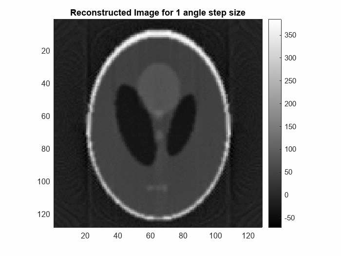

# Computed Tomography (CT) Reconstruction Fault Simulation
This repository contains MATLAB codes for simulating CT reconstruction with limitations on detector step size and angles.

## Table of Contents

- [Introduction](#introduction)
- [Installation](#installation)
- [Usage](#usage)
- [MATLAB Scripts](#matlab-scripts)
- [Results](#results)
- [License](#license)
- [Acknowledgements](#acknowledgements)

## Introduction

Computed Tomography (CT) reconstruction is a technique used in medical imaging to generate cross-sectional images of objects or patients from a series of projection measurements. In this simulation, we focus on two common limitations encountered in CT reconstruction: limited step size in detectors and limited angles of projection.

## Installation

1. Clone this repository to your local machine using:
    ```
    git clone https://github.com/Nakul-Hari/CT_Reconstruction_Fault_Simulation.git
    ```
2. Open MATLAB and navigate to the cloned repository directory.

## Usage

The MATLAB scripts provided in this repository can be used to simulate CT reconstruction under different conditions. Follow the instructions provided in the script comments to adjust parameters and run the simulations. Preferably use **MATLAB Live Editor** to get the Animations as shown here

## MATLAB Scripts

### Limited Step Size in Detectors

The `LimitedStepsizeReconstruction.m` script simulates CT reconstruction when the detectors have a limited step size. This limitation can result in undersampling artifacts and reduced image quality. Adjust parameters such as detector size and step size to observe their effects on reconstruction quality.



#### Theory:
In CT reconstruction, a smaller step size in detectors allows for higher spatial resolution in the reconstructed image. However, limited step size may lead to undersampling, where certain spatial frequencies are not adequately sampled, resulting in artifacts such as streaking and blurring in the reconstructed image.

### Limited Angles of Projection

The `LimitedAngledReconstruction.m` script simulates CT reconstruction with a limited number of angles of projection. Limited angles can lead to incomplete data and streak artifacts in reconstructed images. Explore the impact of varying the number of projection angles on image quality.


#### Theory:
In CT reconstruction, a larger number of projection angles provides more information about the object's internal structure, resulting in higher-quality reconstructed images. Limited angles of projection can cause missing data, leading to streak artifacts and reduced spatial resolution in the reconstructed image.

## Results

The `Results` directory contains sample images and data generated from the simulation scripts. Refer to these results for visualizing the effects of limited step size in detectors and limited angles of projection on CT reconstruction.


## Acknowledgements

This implementation is part of the course work for EE5613: Medical Imaging: Unveiling CT Imaging from Physics to AI Advancements
